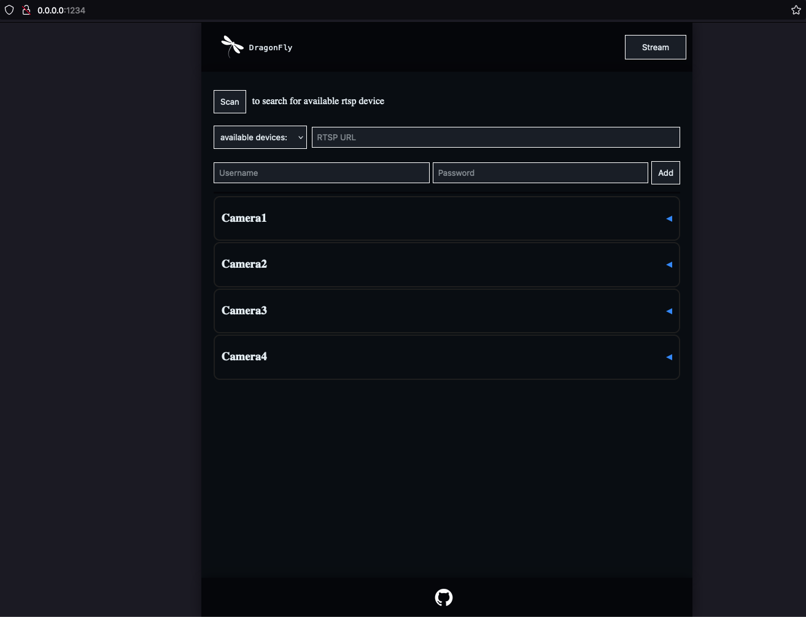
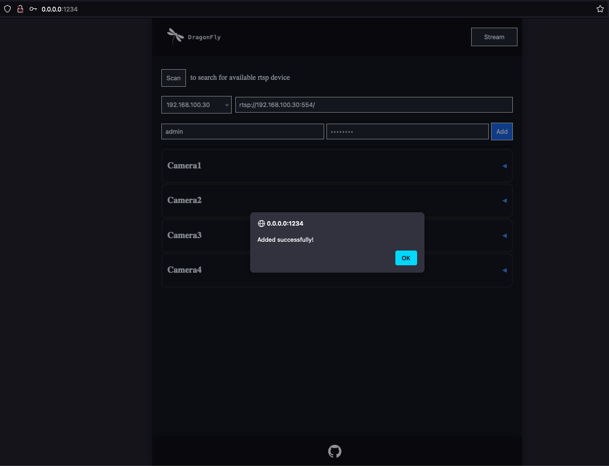
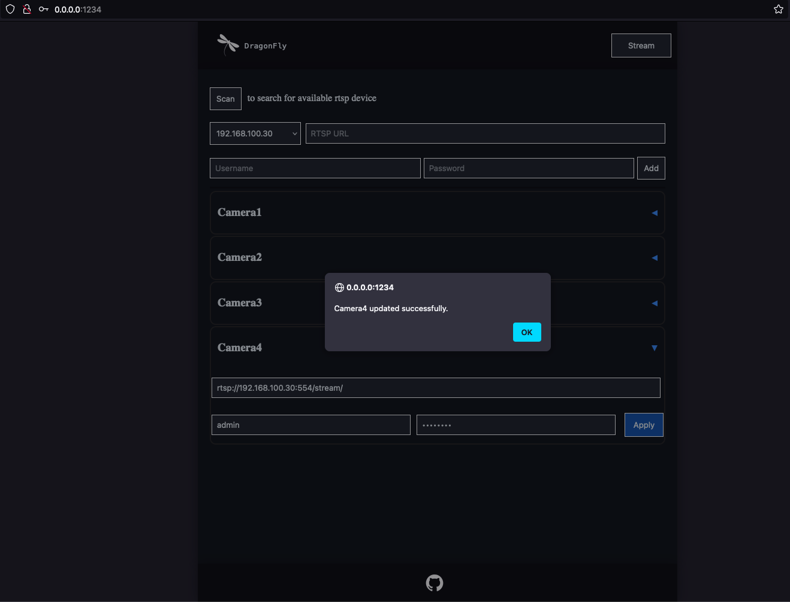

### Screenshot 1 - initial view

### Screenshot 2 - add camera

### Screenshot 3 - edit camera

### Screenshot 4 - delete camera and reassign indexes

### Screenshot 5 - wheel until scanning for rtsp devices

### Screenshot 6 - select menu of found devices

